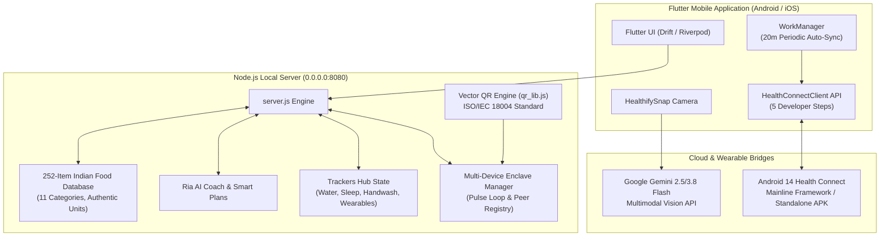

# CaloriQ 🥑⚡
### Intelligent Indian Food & Calorie Tracker, Ria AI Nutritionist & Multi-Device Health Connect Suite

[](https://opensource.org/licenses/MIT)
[](https://flutter.dev)
[](https://nodejs.org)
[](https://developer.android.com/health-and-fitness/guides/health-connect)
[](https://ai.google.dev/)

**CaloriQ** is an end-to-end nutrition, metabolic health, and fitness intelligence suite engineered specifically for Indian dietary habits and international fitness standards. Featuring authentic Indian serving sizes (*katori*, *roti/paratha*, *plate*, *glass*), **HealthifySnap** zero-hallucination photo analysis, **Ria 24/7 AI Nutritionist & Smart Plans**, a multi-dimensional **Trackers Hub** (Water, Sleep, WHO 20s Handwash, Asian Indian BMI, Wearables), Google's **5 Developer Steps for Health Connect** with 20-minute periodic auto-sync, and **Multi-Device Live Sync with scannable QR Code pairing**.

---

## 🏗️ System Architecture



---

## ✨ Key Features

### 🍛 1. One-Touch Indian Food Database & Authentic Serving Units
- **252+ Verified Indian & Global Dishes across 11 Specialized Categories**:
  - **Breads & Staples (35 items)**: Whole wheat roti/phulka, parathas (aloo, paneer, gobi, mooli), thepla, naan, bhakri, ragi roti, litti chokha, steamed basmati rice, jeera rice, curd rice, bisi bele bath, khichdi, poha, upma, dalia, oats, quinoa.
  - **Dals & Legumes (19 items)**: Yellow dal tadka, dal makhani, moong dal, masoor dal, chana dal, panchmel dal, rajma masala, punjabi chole, rawalpindi chole, chole bhature, kala chana, sambar, rasam, kadhi pakora.
  - **Curries & Paneer (33 items)**: Paneer butter masala, palak paneer, kadai paneer, shahi paneer, bhurji, lababdar, malai kofta, methi matar malai, aloo gobi, bhindi masala, smoked baingan bharta, sarson ka saag, soya chunks, mushroom masala, taro arbi fry, crispy karela, drumstick curry.
  - **South Indian Specialties (17 items)**: Idli, masala dosa, mysore masala dosa, rava dosa, ragi dosa, pesarattu, akki rotti, neer dosa, ragi mudde, medu vada, uttapam, appam, coconut chutney.
  - **Poultry, Meat, Seafood & Eggs (34 items)**: Boiled eggs, masala omelette, egg bhurji, chicken curry, butter chicken, chicken biryani, mutton biryani, chicken tikka, mutton rogan josh, rohu macher jhol, shorshe ilish, crab masala, prawns curry, salmon.
  - **Snacks & Chaat (20 items)**: Samosa, pani puri, sev puri, dahi puri, bhel puri, pav bhaji, vada pav, dahi bhalla, aloo tikki chaat, misal pav, ragda pattice, kachori, dhokla, khandvi, roasted makhana.
  - **Dairy & Fitness Staples (18 items)**: Whole milk dahi, greek yogurt, cow milk, toned milk, whey protein isolate, plant protein, peanut butter, chia seeds, flax seeds, raw almonds.
  - **Fruits & Salads (23 items)**: Apple, banana, mango, papaya, pomegranate, custard apple (sitaphal), amla, black jamun, kachumber salad, sweet potato chaat.
  - **Beverages & Coolers (17 items)**: Masala chai, green tea, filter coffee, chaas, sweet lassi, tender coconut water, nimbu shikanji, sugarcane juice, sattu sharbat, haldi doodh.
  - **Mithai & Desserts (19 items)**: Gulab jamun, rasgulla, rasmalai, kaju katli, motichoor ladoo, gajar ka halwa, moong dal halwa, kheer, jalebi, mishti doi, shrikhand, kulfi.
  - **Global & Fast Food (17 items)**: Oatmeal, margherita pizza, veggie burger, pasta arrabbiata, hakka noodles, fried rice, momos, hummus, falafel.
- **Authentic Indian Serving Sizes**: Pre-calibrated for standard household measures: *Katori* (~150g), *Piece* (Roti 35–40g), *Plate* (~350g), *Glass* (~250ml), *Bowl* (220g), *Cup* (150ml).
- **One-Touch Logging**: Real-time category pills, portion multipliers (`0.5x`, `1x`, `1.5x`, `2x`, `3x`), and meal slot selectors (`Breakfast`, `Lunch`, `Dinner`, `Snack`).

---

### 📷 2. HealthifySnap: AI Indian Food Photo Recognition
- Powered by **Google Gemini 2.5 / 3.8 Flash Multimodal Vision** with automated cascade fallback.
- **Trained on Indian Culinary Presentations**: Correctly differentiates rotis, parathas, naans, and theplas from tortillas; recognizes steel thalis, katoris, dals, and subzis under ambient indoor lighting.
- **Zero-Hallucination Mode**: Strictly analyzes only physically visible prepared foods.
- **Auto-Sync to Health Connect**: Approved items are written directly to Android Health Connect `NutritionRecord` storage.

---

### 🤖 3. Ria AI 24/7 Nutritionist & Smart Plans
- Conversational nutritional AI advisor trained on ICMR dietary allowances and regional Indian metabolic science.
- **Interactive Prompt Chips**: Quick consultation on high-protein vegetarian options, healthy restaurant ordering, late-night Indian snacks under 150 kcal, and low-GI rice substitutes.
- **Ria Smart Plans (1-Click Diary Sync)**:
  1. **Weight Loss Accelerator (1,400 kcal)**: 90g Protein • 140g Carbs • 45g Fat
  2. **Lean Muscle & High Protein (1,800 kcal)**: 130g Protein • 180g Carbs • 55g Fat
  3. **Low Glycemic / Diabetic & PCOS (1,500 kcal)**: 80g Protein • 130g Carbs • 55g Fat

---

### ⏱️ 4. Multi-Dimensional Trackers Hub
- **Water Hydration Tracker**: Daily 3,000ml goal with an animated glass water-fill indicator and `+250ml`, `+500ml` buttons.
- **Sleep & Recovery Tracker**: Stage breakdown (Deep, REM, Light sleep), quality rating, and sleep debt meter.
- **WHO 20-Second Handwash Tracker**: Circular SVG animated timer with visual step-by-step guidance for the 6 WHO hand hygiene steps and streak logging.
- **Asian Indian BMI Tracker**: Implements the consensus ICMR/WHO guidelines for Asian Indians:
  - $< 18.5$: Underweight
  - $18.5 - 22.9$: Normal / Optimal
  - $23.0 - 24.9$: Overweight (*Asian Indian cutoff*)
  - $\ge 25.0$: Obese (*Asian Indian cutoff*)
- **Wearables Bridge**: Live battery, resting heart rate, and step synchronization for **Fitbit Charge 6** and **Google Pixel Watch 3**.

---

### 🏃 5. Google Health Connect: 5 Developer Steps
Implements Google's official 5-step integration architecture:
1. **Step 1 (SDK)**: `androidx.health.connect:connect-client:1.1.0-alpha11`.
2. **Step 2 (Manifest)**: Declared `<queries>` package visibility for `com.google.android.apps.healthdata` and all 13 granular Read/Write permissions.
3. **Step 3 (Client Availability)**: Handled `getSdkStatus()` returning `SDK_AVAILABLE`, `SDK_UNAVAILABLE_PROVIDER_UPDATE_REQUIRED`, or `SDK_UNAVAILABLE` (fallback to Mifflin-St Jeor BMR).
4. **Step 4 (Runtime Permissions Contract)**: `createRequestPermissionResultContract()` registered inside `MainActivity.onCreate()`.
5. **Step 5 (Read & Write Client Operations)**:
   - **Read**: Aggregates `StepsRecord.COUNT_TOTAL` and `ActiveCaloriesBurnedRecord.ACTIVE_CALORIES_TOTAL`.
   - **Write**: Bi-directional insertion of `NutritionRecord` for all logged meals, `WeightRecord`, and `ExerciseSessionRecord`.
6. **20-Minute Periodic Auto-Sync**: Background `WorkManager` task coupled with a live UI countdown timer and on-demand trigger.

---

### 📲 6. Multi-Device Inter-Connect & Unique QR Code Sync
- **Unique User / Enclave Code**: Shareable alphanumeric code (e.g. `CQ-8420-9173`) connecting 2 or more devices.
- **High-Resolution Vector QR Code Engine ([`qr_lib.js`](qr_lib.js))**: Zero-dependency, offline ISO/IEC 18004 QR generator that encodes the local Wi-Fi pairing URL (`http://<ip>:8080/?sync=CQ-8420-9173`).
- **Instant Camera Pairing**: Point your phone or tablet camera at the screen QR code to mirror your diary with zero logins or cloud accounts.
- **Real-Time 2-Way Pulse Loop**: Background heartbeat (every 3.5s) mirrors meal logs, water, and workouts across all connected screens.
- **Connected Devices Dashboard**: Live device registry showing active devices (💻 MacBook, 📱 Pixel, 📲 iPad), IP addresses, and last seen timestamps.

---

## 🚀 Quick Start Guide

### Prerequisites
- [Node.js 18+](https://nodejs.org/)
- [Flutter 3.x](https://flutter.dev/) (optional, for native Android/iOS builds)

### 1. Run the Local Server & Web App
```bash
# Clone the repository
git clone https://github.com/Arivuselvan1/caloriQ.git
cd caloriQ

# Start the CaloriQ server
node server.js
```
Open your browser:
- **Local Machine**: [http://localhost:8080](http://localhost:8080)
- **Mobile Phone / Tablet (Same Wi-Fi)**: `http://<your-local-ip>:8080`

### 2. Configure Gemini Vision API Key (Optional)
To enable live AI Food Scanning with Gemini 2.5/3.8 Flash:
- Click **"Gemini Key"** in the top-right header and paste your key from [Google AI Studio](https://aistudio.google.com/app/apikey).
- Alternatively, launch the server with:
```bash
GEMINI_API_KEY="AIzaSy..." node server.js
```

### 3. Connect Multiple Devices
1. In the top navigation bar, click the **`Sync (1)`** button.
2. Scan the displayed QR Code with your mobile phone or tablet camera.
3. Both devices will stay synchronized in real time!

---

## 📁 Repository Structure

```
caloriQ/
├── caloriq_web.html          # High-performance responsive Web App UI
├── server.js                 # Node.js backend API & Enclave Sync Engine
├── qr_lib.js                 # Standalone ISO/IEC 18004 Vector QR Code Engine
├── pubspec.yaml              # Flutter dependencies & metadata
├── analysis_options.yaml     # Dart & Flutter analyzer rules
├── android/                  # Android project & Health Connect Manifest
│   └── app/
│       ├── build.gradle      # Health Connect SDK dependencies
│       └── src/main/AndroidManifest.xml # 13 Read/Write permissions & queries
├── lib/                      # Flutter Native Application
│   ├── main.dart             # App entrypoint
│   ├── core/                 # Constants, themes, calculators
│   ├── data/                 # Drift SQLite database & repositories
│   ├── domain/               # Entities & use cases
│   ├── services/             # WorkManager 20m background sync
│   └── ui/                   # Riverpod UI screens & widgets
└── test/                     # Unit & widget test suites
```

---

## 📄 License
This project is licensed under the MIT License - see the [LICENSE](LICENSE) file for details.
